# **USC CSCI 520: Computer Animation and Simulation**  
#### \- taught by Dr. Jernej Barbič  

## **Programming Assignment 3: Inverse Kinematics with Skinning**  

    Operating System: macOS 10.15
    Source Code Editor: Sublime Text, Version 3.2.2, Build 3211
    Programming Language: C++
    API: OpenGL (Compatibility Profile)
    Libraries Used: ADOL-C, Eigen, Vega FEM

### **ASSIGNMENT DETAILS:**
- Look into the file ```Assignment-3-details.pdf```  
                OR
- Go to [](http://barbic.usc.edu/cs520-s20/assign3)

### **HOW TO EXECUTE THE CODE (For macOS):**
1. To set up ADOL-C and Eigen, follow steps mentioned in the aforementioned assignment description link.  
To set up OpenGL as well, follow the steps in the aforementioned site.  
    > CAUTION:  
    However, for macOS 10.15, ```brew install freeglut``` did not work.  
    I had to do ```brew cask install xquartz``` and then ```brew install
freeglut``` instead.  
    Also, instead of installing freeglut-3.0.0, it installed freeglut-3.2.1. Therefore, after uncommenting “OPENGL_LIBS=-framework OpenGL /usr/local/Cellar/freeglut/3.0.0/lib/libglut.dylib”, I had to convert the 3.0.0 to 3.2.1 i.e. “OPENGL_LIBS=-framework OpenGL /usr/local/Cellar/freeglut/3.2.1/lib/libglut.dylib”.  
    This should be enough to be able to compile the code.  


2. Compile using the command: ```make```.  
Note: To delete all the object files and executables:```make clean```
    > CAUTION:  
    Again, for macOS 10.15, after running ```make```, I got the error:  
    “freeglut (../driver): failed to open display ''“.  
    To resolve this, give Full Disk Access to both XQuartz and Terminal on System Preferences -> Security & Privacy -> Privacy -> Full Disk Access. Then do the golden step of restarting the laptop.  


3. To run the executable:  
    ```
    ./run.sh
    ```
    Editing the run.sh file:  
    * You can change between models by uncommenting the ```cd <model-name-folder>``` you want to render and commenting the one which was in use.  
    * In ```../driver skin.config 0 0```, after filename-'skin.config', next argument is for choice in IK algorithm, and the one after that is for choice in skinning method to be used.  
    IK algorithm - 0(Tikhonov IK method), 1(Pseudoinverse method), 2(Transpose method)  
    Skinning method - 0(Linear Blend Skinning), 1(Dual Quaternion Skinning)  
    By default, i.e. if you keep it as ```../driver skin.config```, both are set to 0.  
    * Instead of ```../driver skin.config 0 0```, you can execute ```../driver changedskin.config 0 0``` to run IK with a set of different IK-Joint-IDs.  
    This can be implemented for all the 4 models – armadillo, hand, dragon and star.  
4. Controls:  
    * ‘r’ – run automation of IK-handle drag (can be toggled on/off)  
    * ‘c’ – toggle visibility of skybox  
    * ‘w’ – toggle visibility of wireframe  
    * ‘e’ – toggle visibility of model mesh  
    * ‘s’ – toggle visibility of skeleton  
    * ‘x’ – take 550 screenshots in sequence and store as .ppm files  
    * ‘=’ – show hierarchy of each joint on the skeleton one by one  
    * ‘\’ – reset camera position to initial position  
    * ‘0’ – reset model mesh and skeleton to rest position  
    * Dragging mouse with the right mouse button clicked - rotation about the x and y axes  
    * Holding SHIFT and dragging the mouse with the middle mouse button clicked - zooming in/out  
    * left,right,up,down arrows - translation in x and y axes  
    * ‘ESC’ - exit  


### **OBJECTIVE:**  
The objective of this assignment is to perform skinning, forward kinematics (FK) and inverse kinematics (IK) to deform a character represented as an obj mesh. The IK algorithm to be implemented is Tikhonov IK method. The skinning method to be used is Linear Blend Skinning.


### **IK Algorithms Implemented:**  
```  
1. Tikhonov IK method  
2. Pseudoinverse method(extra credits)  
3. Transpose method(extra credits)  
```  

### **Skinning Methods Implemented:**  
```  
1. Linear Blend Skinning  
2. Dual Quaternion Skinning(extra credits)  
```  


### **ACCOMPLISHMENTS - CORE CREDITS:**
1. Implemented Forward Kinematics (FK.cpp). 
2. Computed skinning transformations for all the joints (FK.cpp).  
3. Coded Forward Kinematics again for help in computing Jacobian matrix using ADOL-C
(IK.cpp).  
4. Set up ADOL-C by using the above-mentioned Forward Kinematics function as the function
to be computed using ADOL-C (IK.cpp).  
5. Implemented the Tikhonov IK method (IK.cpp).  
6. For skinning, used Linear Blend Skinning (skinning.cpp).  

### **ACCOMPLISHMENTS - EXTRA CREDITS:**
  
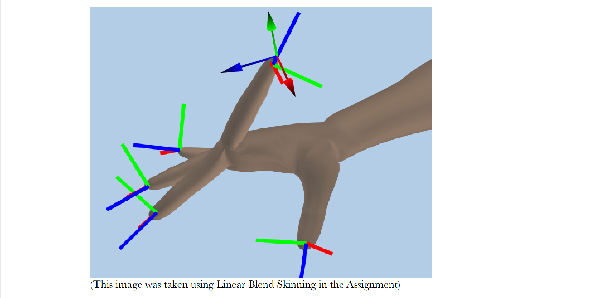  
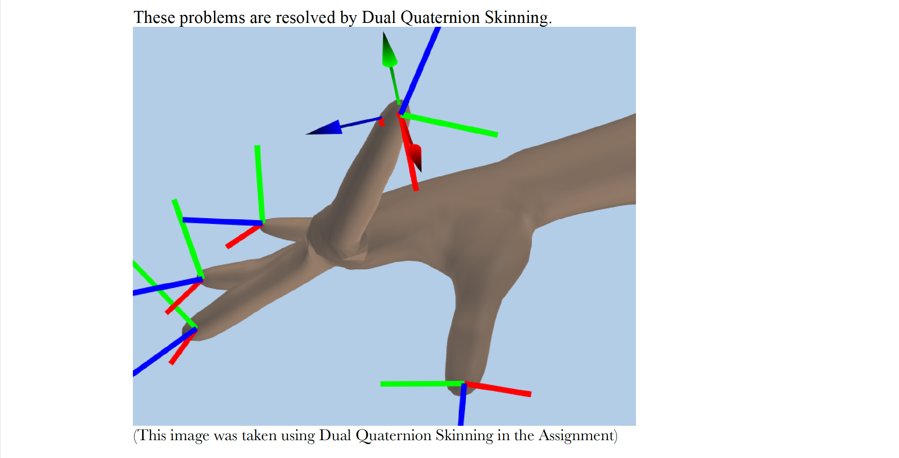  
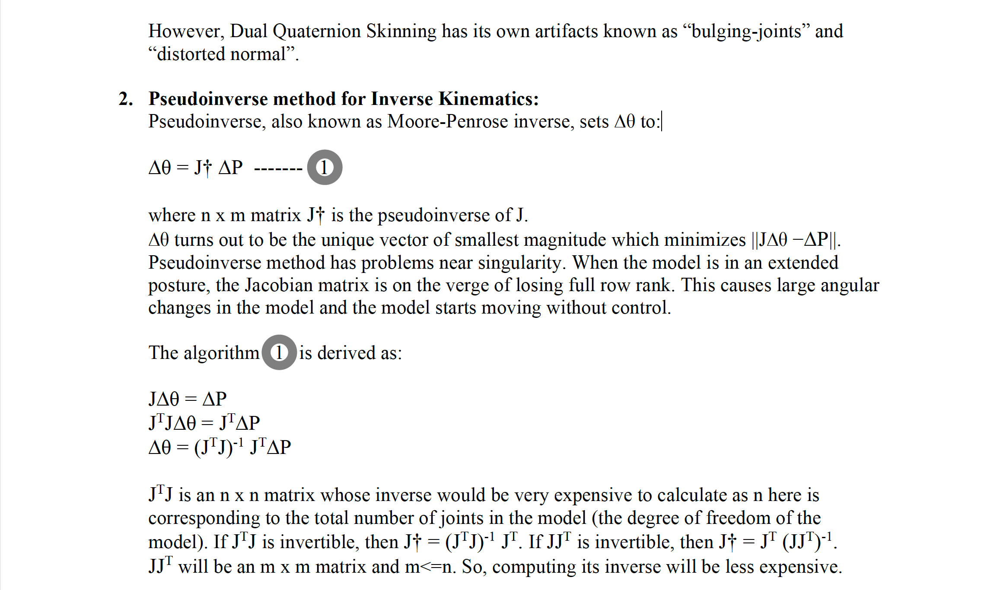  
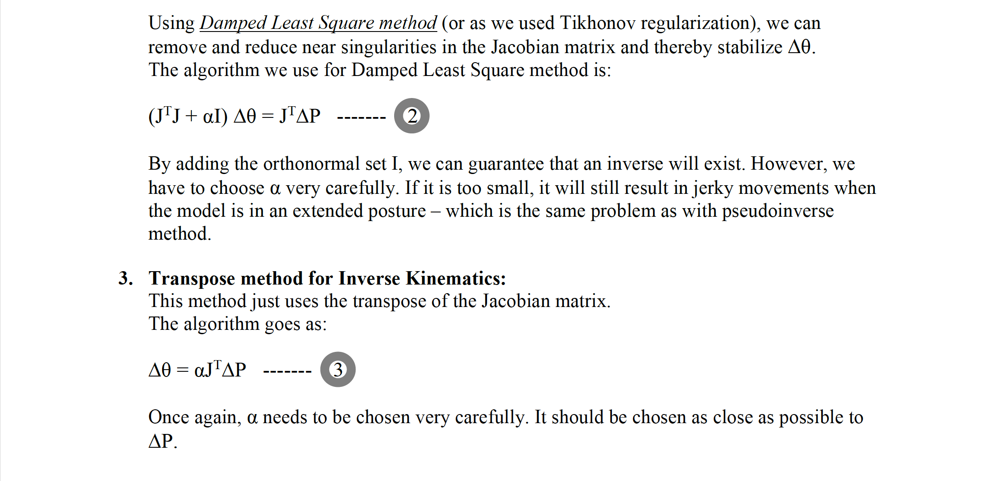  
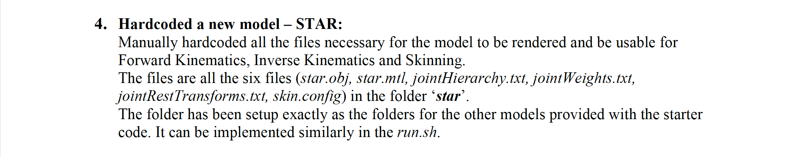  
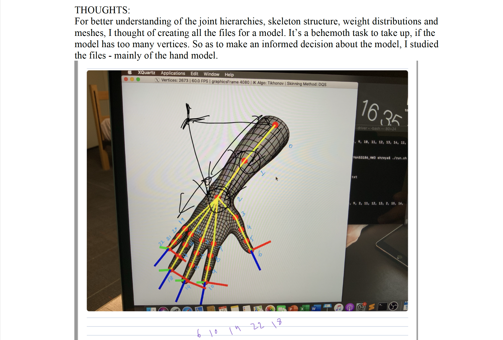  
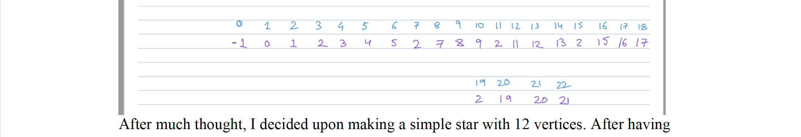  
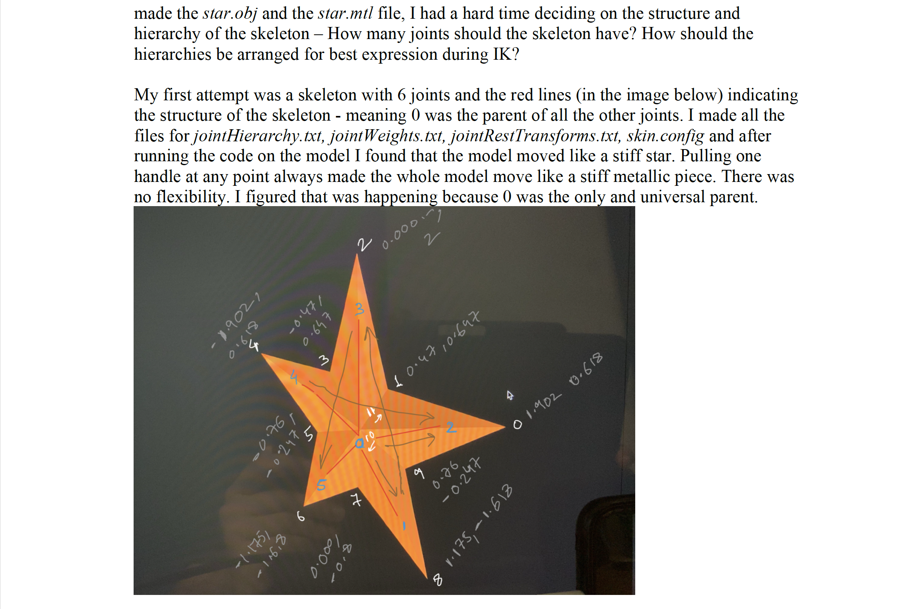  
  
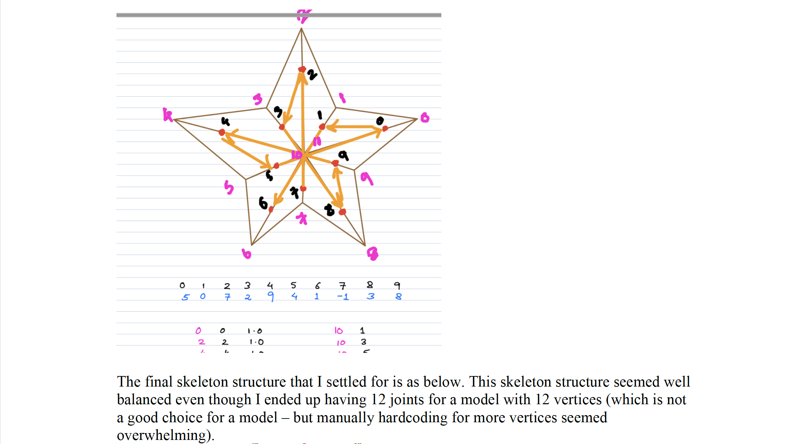  
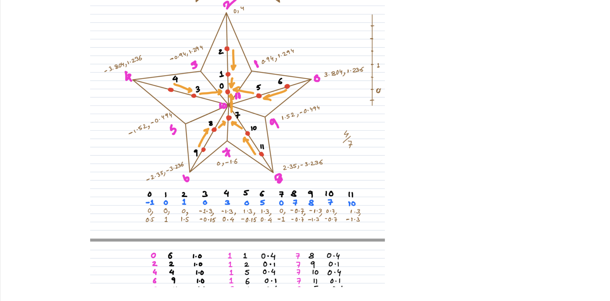  
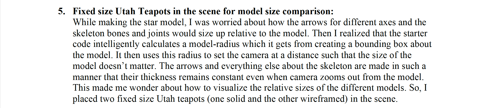  
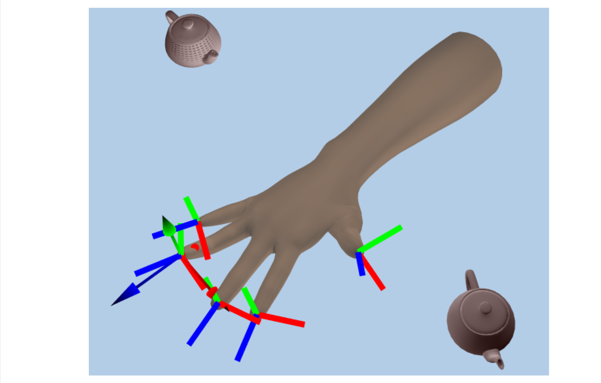  
  
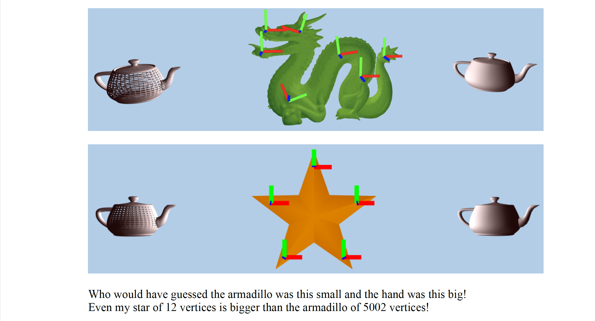  
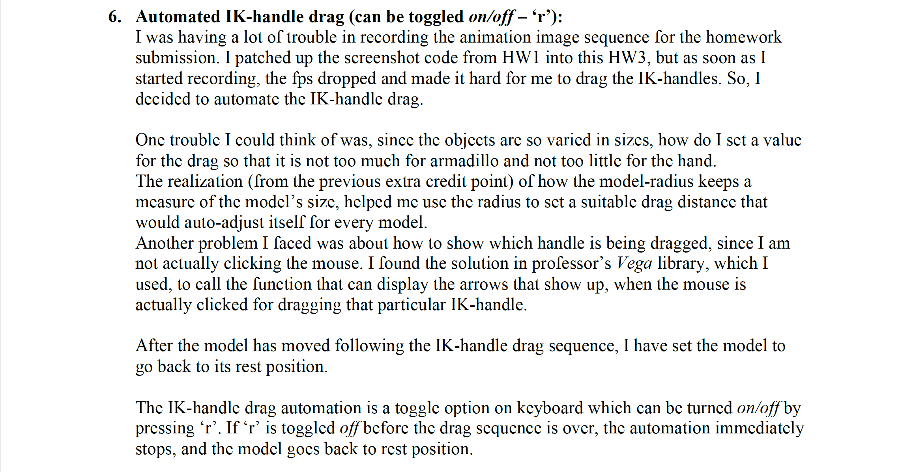  
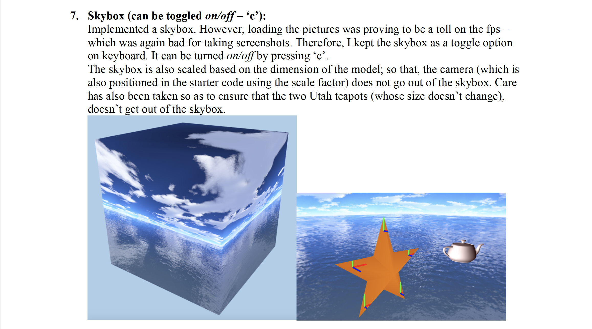  
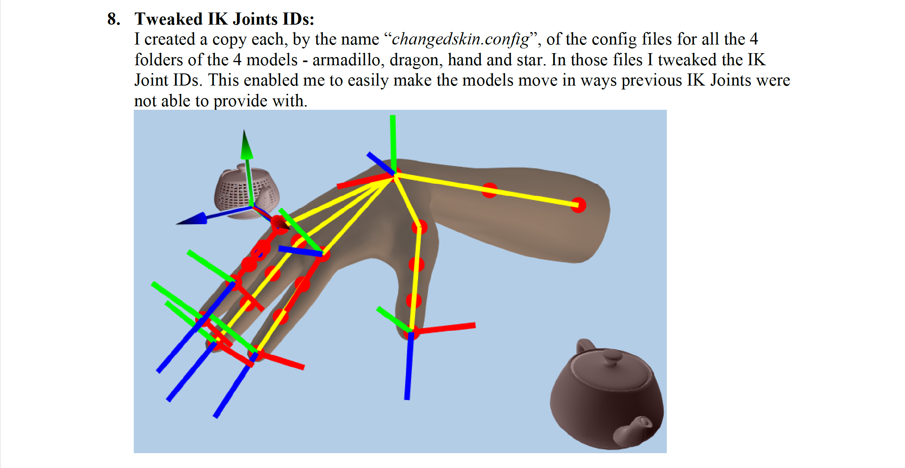  
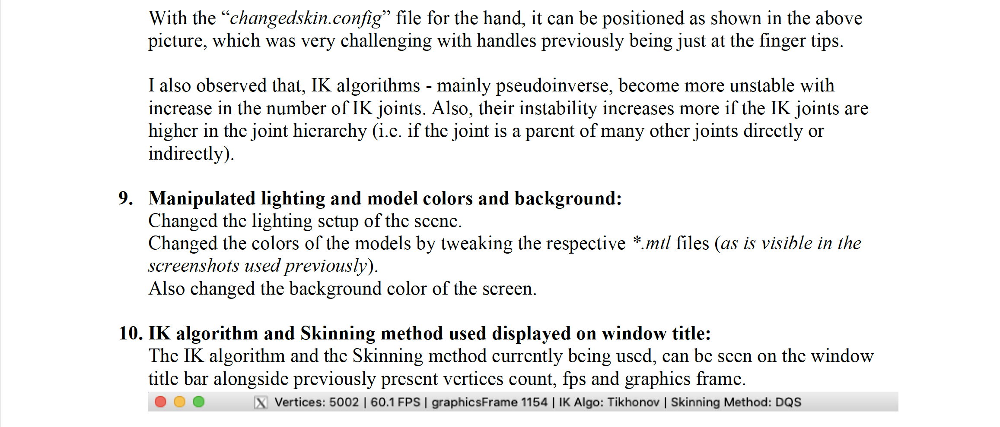  

### **NECESSARY FILES AND FOLDERS LOCATIONS:**  
- The images used for the skybox are stored in the folder “Skybox” in the root.  

### **EXHIBIT:** 
[](https://www.youtube.com/watch?v=dqLlyH3Um3Y)